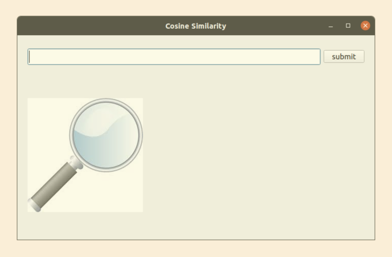
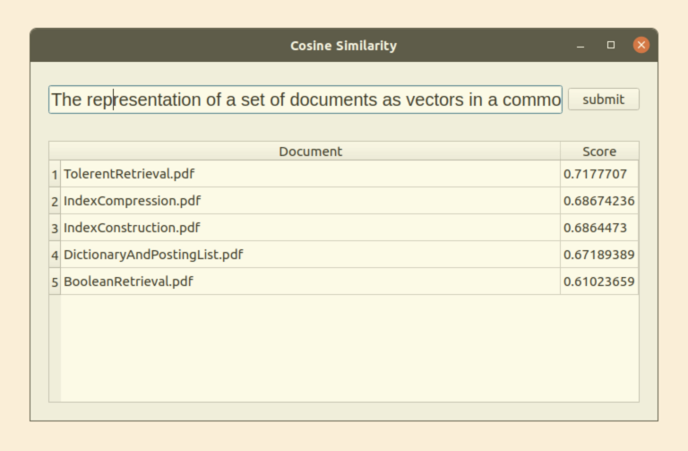
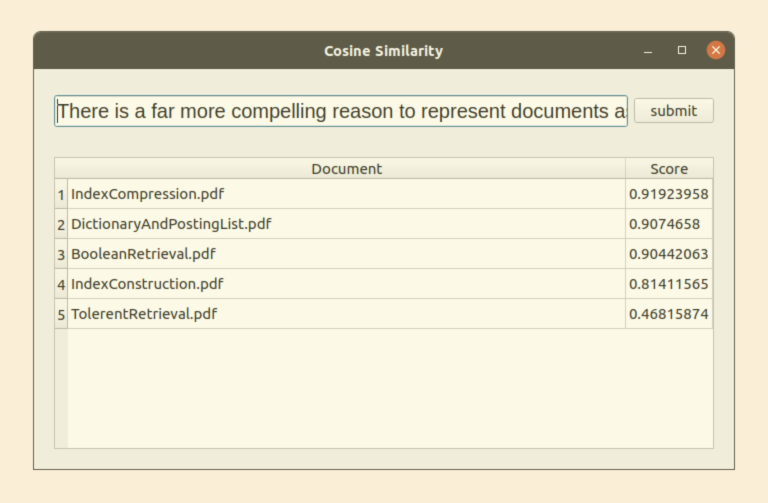

# Information Retrival Project

## Relevence ranking of documents using cosine similarity.

This application has indexed five documents and then uses the term frequency and document frequency to find the cosine similarity between documents and the query and rank documents accourdingly.

(Using Python3)

## Screenshots :

